# Image Management

This document explains how the dashboard treats VM images — the
philosophy that drives the design, the lifecycle the codebase encodes,
and how a single source image becomes an AMI, an Azure Managed Image,
and a GCP Custom Image.

The companion docs:

- [Infrastructure as Code](infrastructure-as-code.md) — what consumes
  images (Terraform deploys, Packer build orchestration)
- [Storage Management](storage-management.md) — where image artefacts
  live between build and promotion
- [Config Management](config-management.md) — what runs *on* the
  resulting VMs after deployment
- [Secrets Management](secrets-management.md) — credentials feeding
  the build/promote process

---

## Philosophy

Image management is downstream of build discipline. If your image
hygiene is good, deployments are reproducible, vulnerability response
is mechanical, and rollbacks are a pointer-flip. If it isn't, every
deploy is a small adventure. The dashboard tries to make the good path
the easy path.

**1. Build once, deploy many.** The same image artefact ships to AWS,
Azure, and GCP. Re-running Packer per cloud doesn't give you "the same
image" — it gives you three independent images that drift the moment
provisioning steps depend on package mirrors, mirror timing, or
upstream release timing. Build the artefact once; promote that exact
artefact everywhere.

**2. Storage-backed portability.** The image artefact lives in your
[storage backend](storage-management.md) of record (S3 / Azure Blob /
GCS / Local-or-UNC). It's a versioned, named, source-controlled
binary blob. The cloud-specific images (AMI / Managed Image / Custom
Image) are *consumers* of that artefact, not the source of truth. If
the AMI is accidentally deleted, the artefact in storage lets you
re-promote without rebuilding.

**3. Same source, multiple targets.** Promotion to a target cloud is a
distinct, idempotent step that pulls the artefact from storage and
calls the cloud's native VM-import API. Adding a fourth target
(Oracle Cloud, on-prem KVM) in the future is a fourth promoter, not a
fourth Packer template.

**4. Lifecycle hygiene by default.** Every image has a name, a
version, a build manifest (Packer template + provisioner output), and
a destroy path. The dashboard records all four against the build job;
deletes propagate through promoters when the operator wants the
artefact gone everywhere.

---

## How the dashboard implements these

| Principle | Where it shows up |
|---|---|
| Build once, deploy many | The Packer integration ([`services/packer_service.py`](../web_dashboard/services/packer_service.py)) supports three builders today. The roadmap is to standardise on one source builder + post-build conversion to the other clouds' formats, so a single Packer run produces three deploys. |
| Storage-backed portability | `archive_to_s3()`, `archive_to_azure_blob()`, `archive_to_gcs()` already export build outputs to the active storage backend. The artefact lands at `images/<name>-<version>/` keyed by the build job ID. |
| Same source, multiple targets | Each cloud's API (`api/aws.py`, `api/azure.py`, `api/gcp.py`) has create-image-from-source endpoints that accept a storage URL. The promote flow calls them in turn. |
| Lifecycle hygiene | Build jobs land in the standard job tracker (`/jobs`) with the Packer template, provisioner stdout/stderr, and resulting image IDs in `extra_data`. Deleting a build job deletes the artefact from storage and (with confirmation) the derived images. |

---

## The image surfaces

The dashboard has several distinct image-related paths. They overlap
in concept but each has its own lifecycle.

### Packer-driven build

The "I want a custom image baked from scratch" path. Three builders
ship today, picked by the cloud the build runs in:

| Builder | Cloud | Output |
|---|---|---|
| `amazon-ebs` | AWS | EBS-backed AMI |
| `azure-arm` | Azure | Managed Image in your subscription |
| `googlecompute` | GCP | Custom Image in your project |

The Packer template is generated in-process from the deploy form
(source AMI / image, instance type, provisioner script, output
naming). Templates aren't pre-staged in the repo because build inputs
are too varied to template statically. The build job streams Packer
stdout/stderr to the live job log so you can watch the provision
steps.

After the build succeeds, the resulting image's ID is captured in
`Job.extra_data` and the artefact (when exported) is uploaded to your
storage backend.

#### Loading the provisioner script from storage

Every Packer form (AWS / Azure / GCP) has a **Load from storage**
dropdown next to the Provisioner Script field. It lists every
`.sh` / `.bash` asset across every configured storage backend
(local, S3, Azure Blob, GCS) tagged with the backend it lives on —
`setup.sh (S3)`, `setup.sh (Local)` — so identical filenames on
different backends are unambiguous.

Selecting an entry fetches the script via
[`GET /api/storage/fetch/{backend}/{name}`](../web_dashboard/api/storage.py)
and drops the text into the textarea. The operator can still tweak
it before submitting; a blue subtitle echoes which backend + name
the script came from so an edited version doesn't quietly drift
from its stored copy.

This means you can keep your hardening scripts version-controlled
on disk or in object storage, upload them once via
[Storage Management](./storage-management.md), and pick them from
the dropdown for every build instead of copy-pasting. Useful when
the same script is reused across cloud providers — store it once on
a cloud backend and load it for all three builds.

#### Passing environment variables to the provisioner

Once a provisioner script is loaded, every Packer form (AWS / Azure /
GCP) shows an **Environment variables** panel — a repeatable
name/value table whose entries are handed to the shell provisioner as
`environment_vars`. Use it to parameterise a reused script (package
versions, feature flags, registration endpoints) instead of forking
the script per build.

Each row has a **secret ref** toggle:

- **Off (literal).** The value is inlined into the generated Packer
  template verbatim.
- **On (secret reference).** The value is a reference into your
  configured [secrets backend](./secrets-management.md) —
  `aws_sm://dashboard/db_password`, `azure_kv://db-password`,
  `gcp_sm://db-password`, or `bt_safe://…`. It's resolved at
  build-launch (close to when the provisioner runs) via
  `config_service`, the same resolver the rest of the dashboard uses.

Secret values are deliberately kept **out of the template**: a
resolved secret is passed through a Packer **sensitive variable**
(`PKR_VAR_*` injected into the build subprocess), and the template
only ever contains the declaration plus a `${var.…}` reference. So a
secret never lands in the **archived** template (when "Archive
template" is on, the `.pkr.hcl` is uploaded to your storage backend)
and Packer redacts it from the build log. Literal values, having no
such protection, should not be used for secrets.

Environment-variable names are validated (`[A-Za-z_][A-Za-z0-9_]*`)
so a name can't break out of the `environment_vars` array.

> **BeyondTrust provisioner options.** Above the generic table sits a
> dedicated **BeyondTrust provisioner options** block (admin user,
> Install EPM-L deb/rpm, Entitle SSH public key) — a convenience layer
> over the same mechanism that drives the
> [`bt-ready-*` scripts](../provisioners/beyondtrust/README.md). It
> sets `BT_ADMIN_USER` / `BT_ENTITLE_PUBKEY` and, for EPM-L, resolves a
> fresh BeyondTrust presigned package URL into `BT_EPML_URL` via the
> [EPM-L integration](./integrations/beyondtrust.md) at build-launch
> (those links expire ~30 min). On Azure the panel shows only for
> Linux builds — the Windows path uses a PowerShell provisioner, not
> the shell `environment_vars` mechanism.

#### Windows builds (Azure)

The Azure Packer form builds **Windows** managed images too — pick a
Windows preset (Windows Server 2022 / 2022 Core) or set
`os_type: "Windows"` on `POST /api/packer/azure/build`. Differences
from the Linux path:

- **WinRM, not SSH.** Packer connects over WinRM HTTPS (5986) to the
  temp build VM and provisions a *transient Azure Key Vault* to hold
  the WinRM certificate — the dashboard's service principal needs Key
  Vault create rights in the build resource group and the
  `Microsoft.KeyVault` provider registered on the subscription.
- **PowerShell provisioner.** The provisioner script is a `.ps1`
  (the storage dropdown filters to `.ps1` assets when Windows is
  selected) and runs before a `windows-restart`, so feature installs
  settle before generalization.
- **Sysprep, not waagent.** The build always ends with the canonical
  Azure finisher: wait for `RdAgent` + `WindowsAzureGuestAgent`,
  `Sysprep /oobe /generalize`, then poll `ImageState` until the
  reseal completes. Without it the captured image is specialized and
  undeployable.
- **Sizing.** Windows builds crawl on 4 GB burstable sizes; the form
  nudges Windows presets to `Standard_D2s_v3`. Expect 30–60+ min.

A ready-made starter provisioner ships at
[`provisioners/beyondtrust/bt-ready-windows.ps1`](../provisioners/beyondtrust/bt-ready-windows.ps1):
it installs **OpenSSH Server**, enables **RDP + NLA**, sets the SSH
default shell to PowerShell, and (optionally) authorizes an SSH public
key — turning a Windows Server Core image into one you can reach by
`ssh` like a Linux VM, plus agentless RDP through the Jumpoint. Upload
it to `/storage` (the layer tags `.ps1` as `powershell`) and Load it,
or paste it in. See
[provisioners/beyondtrust/README.md](../provisioners/beyondtrust/README.md#windows-bt-ready-windowsps1).

Deploying a Windows image (deploy form, bulk deploy, or a Desktops
pool) generates a strong local-admin password per VM, stores it in
the configured [secrets backend](secrets-management.md) (the
`database` backend works out of the box), and records only the
`(backend, ref)` pair in job metadata. Retrieve it per VM via
**Azure → VMs → Password** (`GET /api/azure/vms/{name}/admin-password`).
Azure can't inject an SSH key into a Windows VM at deploy time (that's
Linux-only), so the BeyondTrust Shell Jump (SSH) step is skipped at
deploy — but if the image baked OpenSSH + your key (above), you can SSH
in directly, and otherwise broker access with an RDP jump item.
The image registry records `os_type` per image so cross-cloud
promotes import Windows VHDs as Windows (registry rows predating the
column default to Linux).

### Capture from a running instance

The "I have a VM I've been hand-tuning, snapshot it as an image" path.
Every deploy form has a "Create image" action; the dashboard:

1. Stops the instance (or doesn't, depending on the cloud's snapshot
   semantics — AWS allows live snapshot, Azure requires deallocate +
   generalize).
2. Calls the cloud's native image-creation API.
3. Records the resulting image ID against the source-instance job.

Useful for one-offs but not the recommended steady-state path —
captured images are harder to reproduce than Packer-built ones, and
the build manifest is "whatever was on this VM at this moment", which
ages poorly.

### Image browsing

The per-cloud pages list both your private images (account-scoped)
and curated public catalogues:

| Cloud | Private | Public |
|---|---|---|
| AWS | Your account's AMIs (region-scoped) | A curated allow-list of well-known AMI publishers (Amazon Linux, Ubuntu, Debian) |
| Azure | Managed Images + Shared Image Gallery versions | Azure Marketplace (Ubuntu / RHEL / Debian, with provider-publisher whitelist) |
| GCP | Custom Images in your project | Public OS family catalogue (Debian, Ubuntu, Rocky, Windows Server) |

The deploy forms also accept a free-text "Deploy from AMI ID / URN /
Image URI" so you can launch from anything your account can see, not
only the curated lists.

### Storage-backed promotion (the lifecycle this doc anchors)

The lifecycle this doc is mostly about, surfaced on the
**`/images`** page. Source of truth: the image artefact (VHD by default)
sitting in your **hub backend**, recorded as a `RegisteredImage` row.
Targets: AMI / Managed Image / Custom Image, one or more.

The end-to-end flow:

```mermaid
flowchart LR
    build["Packer build<br/>AWS / Azure / GCP"] --> export["Native export to<br/>same-cloud storage"]
    export -- "same-backend as hub<br/>(no copy)" --> hub[("Hub backend<br/>S3 / Blob / GCS")]
    export -- "different cloud<br/>(cross-backend copy)" --> hub
    hub -- "presigned URL" --> runner["Target-cloud runner<br/>ECS / ACI / Cloud Run"]
    runner -- "qemu-img convert<br/>+ upload" --> staging[("Target-cloud staging")]
    staging --> imp["Cloud import API<br/>ec2.ImportImage<br/>images.create_or_update<br/>images.insert"]
    imp --> ami["Native image<br/>AMI / Managed Image / Custom Image"]
    ami --> promo["RegisteredImage.promotions"]
    style hub fill:#e0e7ff
    style ami fill:#d1fae5
```



#### Build → hub

After a successful Packer build the dashboard exports the image to a
portable VHD via the cloud's native API and lands it on the **hub**
backend, recording the resulting URL on `RegisteredImage.artefact_url`.
You set the hub on `/storage` via `storage_hub_backend`; if unset it
falls back to the active backend (so single-backend installs Just
Work without configuration). Per build cloud:

- **AWS** — `ec2:ExportImage` writes a VHD to S3. Requires the
  `vmimport` IAM service role; override the role name with
  `aws_vmimport_role_name` if you've named yours differently.
- **Azure** — Snapshot the managed image's OS disk, grant a read-only
  SAS URL, server-side blob-copy into the configured Azure Blob
  container as a VHD, then revoke and clean up the snapshot. No
  egress through the dashboard.
- **GCP** — Submit a Cloud Build job running the upstream
  `gcr.io/compute-image-tools/gce_vm_image_export` Daisy workflow
  with `-format=vpc`, writing the VHD to GCS.

When the build cloud matches the hub backend, the native export *is*
the hub upload — no extra copy. When they differ (e.g. AWS build with
hub = Azure Blob), the dashboard runs `storage_service.copy()` to
stream the VHD from same-cloud staging into the hub, then deletes the
staging copy so you don't pay for two. See `_land_on_hub()` in
[`api/packer.py`](../web_dashboard/api/packer.py).

#### Manual export (recovery path)

The auto-export above is part of every successful Packer build, but
sometimes it gets skipped — no S3 bucket configured, no Azure storage
account on the `/storage` page, the export task timed out mid-build,
etc. The Packer build still completes and the cloud-native image (AMI
/ Managed Image / Custom Image) is fine; it just isn't on the hub and
isn't registered for cross-cloud promotion.

To recover without rebuilding, every cloud Images tab has an
**Export VHD** action on each existing image:

- **AWS Private AMIs** — Export VHD button alongside Deploy / Delete.
- **Azure Managed Images** — Export VHD action.
- **GCP Custom Images** — Export VHD on each image card.

Clicking it prompts for a registry name (defaults to a sanitized
version of the image's native name), then runs the same export →
land-on-hub → register flow that the Packer post-build path runs.
You're redirected to `/jobs/<id>` for live progress. End-to-end this
takes 15–60 minutes depending on image size and whether the build
cloud is the hub cloud (no copy) or a different cloud (cross-backend
copy).

Endpoints behind the buttons:
- `POST /api/aws/amis/{ami_id}/export`
- `POST /api/azure/images/{image_name}/export` (optional
  `resource_group` in body; defaults to `azure_resource_group`)
- `POST /api/gcp/images/{image_name}/export`

Each takes `{image_name: <registry name>}` and returns
`{job_id, status, message}`. Same cloud-storage prerequisites apply
as for the auto-export — AWS needs an S3 bucket, Azure needs a
storage account, GCP needs a GCS bucket. The job log surfaces a
clear "Export skipped: no S3 bucket configured" (or equivalent) if
the prerequisite is missing.

#### Pre-flight checks

The **Promote** modal runs an advisory pre-flight check the moment
you pick a target cloud. The checks are pure-Python (no cloud-side
API calls, returns in <100ms) and cover the local-state blockers
visible without leaving the dashboard:

- Artefact recorded — `artefact_url` and `artefact_format` are set
- Format compatibility — VHD/VMDK/RAW/OVA matrix per target cloud
- Cross-storage copy required — informational, since the runner
  handles it automatically
- Target credentials configured — the dashboard's config store has
  the credentials the target cloud's import API will use

Failing checks don't block — the **Promote** button still works —
but they're surfaced visually so the operator doesn't kick off a
30-minute import only to discover credentials were missing. The
endpoint is `POST /api/images/{id}/preflight` with `{target_cloud}`
body; response shape is `{checks: [{name, status: pass|warn|fail, detail}]}`.
Runner-time errors (IAM mid-flight, quota, format quirks) surface
on `/jobs/<id>` once the actual promote runs.

#### Automated cross-cloud promote

When you click **Promote** on an image, the dashboard enqueues an
`image_promote_<target>` Job and runs the conversion + import in a
transient container in the *target* cloud:

| Target | Runner | Cloud SDK call | Conversion |
|---|---|---|---|
| AWS | ECS Fargate task | `ec2.ImportImage` | None (VHD passthrough) |
| Azure | ACI container group | `compute.images.begin_create_or_update` | None (VHD passthrough) |
| GCP | Cloud Run Job | `compute.images.insert` | `qemu-img vhd → raw` + `tar.gz`-wrap with `disk.raw` entry |

The runner pulls the hub artefact via a short-lived presigned URL
minted at task-launch time, so it never holds hub-side credentials.
On exit the dashboard calls the cloud's image-import API against the
staged blob, polls until the resulting image is `Available` /
`Succeeded` / `READY`, then deletes the staged copy and records the
final identifier on `RegisteredImage.promotions[<target>]`.

The runner image is `chrweav/dashboard-promote-runner:latest`
by default; override via `promote_runner_image` if you maintain a
hardened private build. See
[`runners/promote/README.md`](../runners/promote/README.md) for the
operator prerequisites (IAM, quotas, networking) per target cloud,
the full list of `promote_runner_*` config keys, and local build
instructions for maintaining a custom or hardened build.

If your dashboard credentials can't reach the target — e.g. cross-
account promotes or air-gapped tenants — pass `?manual=1` on the
promote endpoint (or click "Show manual steps instead" in the modal)
and the dashboard returns the operator-runnable CLI walkthrough as
before. The promotion is recorded as `manual` in the registry; run
the commands yourself, then re-promote (or `record_promotion` via the
API) to fill in the resulting native image ID.

Format expectations per target:

| Target | Native import format | Path |
|---|---|---|
| AWS | VMDK / OVA / RAW / VHD via `ec2.ImportImage` | hub → staging S3 → `import-image` task → AMI |
| Azure | VHD via `Microsoft.Compute/images` | hub → staging Blob → `images.create_or_update` → Managed Image |
| GCP | tar.gz containing `disk.raw` via `images.insert` | hub → staging GCS → `images.insert` → Custom Image |

---

## Workflow

A typical build-and-promote cycle:

1. **Build** — operator picks a base image, a provisioner script
   (shell, Ansible playbook from the storage backend, or both), and a
   target cloud for the source build. Packer runs in a one-shot
   container; build stdout streams to the job log.
2. **Capture artefact** — Packer output is exported to a portable
   format (VHD for cross-cloud reach) and uploaded to the active
   storage backend at `images/<name>-<version>/`.
3. **Cloud-native registration** — in the source cloud, the artefact
   is also registered as that cloud's native image (AMI / Managed
   Image / Custom Image). You can deploy from it immediately even
   without promotion.
4. **Promote** (optional) — operator picks a target cloud (+ region
   for AWS, resource group for Azure) in the image's promote panel.
   The dashboard enqueues an `image_promote_<target>` Job; the target
   cloud's runner pulls the hub artefact, converts format if needed,
   uploads to target-cloud staging, calls the cloud's VM-import API,
   and records the resulting native image ID on
   `RegisteredImage.promotions[<target>]`. Staged blobs are deleted
   after the cloud-side image reaches its terminal-ready state.
5. **Deploy** — the per-cloud deploy forms see the new images in
   their respective lists and can launch instances from them.

Destruction is the same path in reverse: pick the build job, "delete
image and all promotions", and the dashboard tears down the native
images in each cloud and removes the artefact from storage.

---

## Best practices

**Treat images like git tags.** Build immutably, name deterministically
(`hardened-ubuntu-22.04-2026-04-12`), promote from named versions
rather than `:latest`. The dashboard supports the build/promote
naming explicitly but doesn't enforce hygiene.

**Test in one cloud before promoting.** A successful Packer build
proves provisioning ran; it doesn't prove the resulting image actually
works. Deploy a single test VM in the source cloud, sanity-check the
service comes up, *then* promote.

**Pin source-image versions in your Packer template.** Don't say "the
latest Ubuntu 22.04" — say "ami-xxxxxxxxxxxxxxxxx as of 2026-04-12".
Otherwise builds become a function of when you ran them, and "rebuild
from manifest" loses meaning.

**Version your provisioner scripts.** The provisioner is part of the
image's manifest. A `.sh` script in
[storage](storage-management.md) labelled `harden-base.sh` and
re-edited in place gives you the same problem as a mutable image:
you can't reproduce older builds. Date-stamp or version it.

**Don't promote to a cloud you don't have credentials for.** The
promote flow needs cloud-native VM-import permissions in addition to
the dashboard's normal deploy permissions. AWS needs
`ec2:ImportImage`, Azure needs `Microsoft.Compute/images/write`, GCP
needs `compute.images.create` plus a service account that can read
from the source GCS object. Configure these once before your first
promotion run.

**Delete propagation is opt-in.** When you delete a build, the
dashboard offers (but doesn't enforce) "delete derived AMI / Managed
Image / Custom Image too." For production images that are still in
use somewhere, leave them alone; for one-off builds, sweep them with
the artefact.

**Promotions are independent jobs.** A failed Azure promotion doesn't
roll back the AWS one. Each lands in `/jobs` with its own success /
failure state. Mostly this is a feature — partial fan-out is a normal
state — but plan retries explicitly rather than expecting an atomic
all-or-none outcome.

---

## Where this is heading on SaaS

A few things the community edition does *not* try to do. They're
SaaS priorities — see [docs/saas-comparison.md](saas-comparison.md)
for the hosted-edition philosophy.

> **Already shipped in community (was previously on this list):**
> one-click cross-cloud promote and pre-flight cloud-credential checks.
> The runner-driven promote flow above runs in the community edition;
> SaaS retains a stronger guarantee — durable replay-safe workflows
> (Temporal-backed) so a 45-minute import survives a dashboard restart
> mid-poll without orphan tasks. Same registry, same `/images` UI,
> same audit trail; the SaaS edition just adds replay-safety on top.

- **Local image builds via Azure Arc.** The hosted edition can
  register an Azure Arc runbook worker on your on-prem build host and
  run image builds *there*, against your VMware / Hyper-V hypervisor,
  without sending build traffic through public internet egress. The
  resulting artefact gets pushed to the SaaS-tenant storage backend
  and is available for cloud promotion exactly the same way as
  cloud-built images. Same workflow, different runner location.
- **Continuous CVE scanning per image version.** SaaS keeps every
  build's manifest and component bill-of-materials, runs scheduled
  vulnerability checks against published CVE feeds, and surfaces
  affected images in the dashboard. Community runs leave this kind
  of telemetry on the table — image hygiene is your discipline, not
  the platform's.
- **AI-assisted hardening.** Suggestions like "this image is missing
  CIS benchmark §5.2.3 — apply this provisioner snippet to your next
  rebuild." Same shape as the AI-assisted Ansible playbook generation
  the SaaS edition will offer for config management.
- **Centralised image catalog across tenants.** Multi-tenancy means
  one organisation's blessed base image is reusable by every team in
  that org without duplicating storage. Community is single-tenant by
  design; one image library per dashboard deployment.

The build-once-promote-many philosophy in this doc carries forward to
SaaS unchanged. What changes is *where the build happens* (Arc-managed
on-prem worker vs. the dashboard host's local Docker), the audit
trail (per-tenant signed build manifests vs. the community edition's
job log), and the cross-tenant catalog.

---

## Troubleshooting

**Packer build hangs at "Waiting for SSH/WinRM."**
The base image's security group / NSG / firewall doesn't permit the
build runner's source IP. Check the cloud-side network policy on the
ephemeral build instance Packer creates. For **Windows builds behind
a TLS-inspecting corp proxy**, also verify WinRM egress: from the
app container, `timeout 5 bash -c "</dev/tcp/<build-vm-ip>/5986"` —
if 5986 is blocked while 22 works, the proxy is eating WinRM; build
from an unproxied network or switch the template to a private-VNet
build (`virtual_network_name` / `virtual_network_subnet_name`).

**Windows build fails creating the temp Key Vault.**
Packer provisions a transient Key Vault for the WinRM certificate.
Grant the service principal Key Vault create rights in the build RG
and register the `Microsoft.KeyVault` resource provider on the
subscription (`az provider register --namespace Microsoft.KeyVault`).

**Build succeeds but storage upload fails with "no active backend"
or "Export skipped: no S3/Azure/GCS configured."**
The Packer build itself succeeded; only the export-to-hub step was
skipped. The cloud-native image is registered and deployable. To get
it onto the hub (and enable cross-cloud promote), do one of:
- Configure the missing storage prerequisite on `/storage` and click
  **Export VHD** on the image in its per-cloud Images tab. Same flow
  as the auto-export, just operator-triggered.
- Or re-run the build (slower, full Packer cycle).

**Promote to Azure fails with "VHD format unsupported."**
Azure's VM import wants a fixed-size VHD, not a dynamic one (and not
RAW). The dashboard's converter produces fixed-size by default; if
you've replaced it with a custom converter, double-check the output
format with `qemu-img info`.

**Azure browse/promote fails with `AuthorizationFailed` on
`Microsoft.Compute/galleries/images/read` or
`Microsoft.Compute/images/read`.**
The Shared Image Gallery lives in a resource group *outside* the one
the dashboard service principal was granted on, so it has no rights
there. `Reader` on that RG fixes browsing; promoting *into* the
gallery also needs managed-image and gallery-image-version writes, so
grant `Contributor` or the least-privilege `Dashboard Image Promoter`
custom role (read galleries/images + write managed images and gallery
image versions). The sandbox bootstrap automates the grant — re-run
with the gallery RG exported:

```bash
AZURE_IMAGE_GALLERY_RG=myGalleryRG AZURE_IMAGE_GALLERY_NAME=corpImageGallery \
  ./scripts/sandbox/Linux/setup-azure.sh
```

It creates the custom role (if missing) and assigns it to the SP
scoped to that RG; override with `AZURE_IMAGE_GALLERY_ROLE=Contributor`,
or set `AZURE_IMAGE_GALLERY_SUBSCRIPTION_ID` for a cross-subscription
gallery. On a non-sandbox install, grant the same role by hand with
`az role assignment create … --scope /subscriptions/<sub>/resourceGroups/<rg>`.
RBAC is eventually consistent — wait a minute or two and refresh the
dashboard's credentials after granting.

**Promote to GCP fails with "image source URI access denied."**
The GCP service account configured in Setup → GCP doesn't have
`storage.objects.get` on the GCS bucket you're promoting from. Grant
`roles/storage.objectViewer` on the bucket.

**Image disappears from the per-cloud Private list after a successful
build.**
The image was created in a different region than the per-cloud page
is currently viewing. Use the region selector to find it, or add the
region to the dashboard's `aws_region` / `azure_location` /
`gcp_region` config so the warmer caches it.

**"Build artifact not found" when promoting.**
The build job's storage upload didn't complete (network blip during
upload, backend swap mid-build). Re-run the build, or manually upload
the artefact under the expected `images/<name>-<version>/` key prefix.
